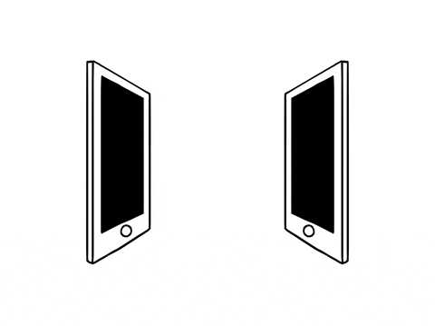

<table width="100%">
  <tr>
    <td align="left">
      
    </td>
    <td align="right" width="120">
      <div>
        
      </div>
    </td>
  </tr>
</table>
  

<h2 align="center">Leetcode Info</h2>  

<p align="center">
  <a href="https://leetcode.com/manishkandari09/" target="_blank">
    
  </a>
   <a href="https://leetcode.com/its-manishkandari09/" target="_blank"></a>
</p>

<p align="center">
    
</p>


<!--<table align="center">
  <tbody>
    <tr>
     `
      <td width="50%" align="center" valign="top">
        <h3 style="font-size: 28px; color: #4CAF50; font-family: 'Roboto', sans-serif;"><strong>A dedicated Computer Science Engineering student</strong></h3>
        <p style="font-size: 50px; color: #333; font-family: 'Arial', sans-serif;">Passionate about leveraging technology to create meaningful solutions.</p>
        <p style="font-size: 50px; color: #333; font-family: 'Arial', sans-serif;">👀 Exploring new opportunities, and embracing challenges that come my way, both academically and personally.</p>
        <p style="font-size: 50px; color: #333; font-family: 'Arial', sans-serif;">🌱 I’m currently immersing myself in the intricate world of codings and softwares development as part of my learning journey.</p>
      </td>
  `
      <td width="50%" align="center" valign="top">
        
      </td>
    </tr>
  </tbody>
</table>-->


🌌 Tech Universe
  
⚡ Core Powers

```python
class ManishKandari:
    def __init__(self):
        self.username = 'manishkandari9'
        self.name = 'Manish Kandari'
        self.web = 'https://manishkandariPortfolio'
        self.leetcode = '@manishkandari09'
        self.linkedin = 'manishsinghkandari'

        self.code = {
            'languages': ['JavaScript', 'Python', 'C++', 'C', 'Java', 'Go', 'TypeScript'],
            'web_tech': ['React.js', 'Node.js', 'Next.js', 'Express', 'Tailwind CSS'],
            'database': ['MongoDB', 'PostgreSQL'],
            'tools': ['GIT', 'GitHub'],
        }

        self.dev_tools = ['Docker']

    def __str__(self):
        return self.name


if __name__ == '__main__':
    me = ManishKandari()
    print(me)

```
  

🛸 Mission Control

  

# 🎨 Design Arsenal

### 🛠️ Design Tools

```javascript
const design_tools = {
    "UI/UX": ["Figma", "Framer", "Adobe XD"],
    "Graphics": ["Adobe Photoshop", "Adobe Illustrator", "Canva"],
    "Prototyping": ["Figma", "Framer", "Sketch"],
    "AI Tools": ["Uizard", "Galileo AI", "Visily"]
};

```
<div align="center">
  <h3>🚀 Frameworks that I have worked on</h3>
  <div>
    <!-- React -->
    
    <!-- Next.js (Colorful Custom SVG) -->
    
    <!-- Node.js -->
    
    <!-- Express.js (Commented Out) -->
    
    <!-- Tailwind CSS -->
    
    <!-- Django -->
    
    <!-- Flask -->

    <!-- FastAPI -->
    
    <!-- Go (Colorful version) -->
    
  </div>
</div>


  
<div align="left">
  <h3>My Contribution</h3>
  <div align="center">
</div>
  <div align="center">
  
</div>
</div>


<div align="center">
  <h3 style="font-size: 24px;">🔥 Github Streak Stats</h3>
  
<!-- snake -->

<!-- GitHub Contribution Snake Animation -->
<div align="center">
  <picture>
    <source media="(prefers-color-scheme: dark)" srcset="https://raw.githubusercontent.com/manishkandari9/manishkandari9/output/github-contribution-grid-snake-dark.svg" />
    <source media="(prefers-color-scheme: light)" srcset="https://raw.githubusercontent.com/manishkandari9/manishkandari9/output/github-contribution-grid-snake.svg" />
    
  </picture>

  
</div>


<!--    -->
<!-- </div>  -->

<p align="center">
  <!-- stats (start) -->
</p>
<table align="center">
  <tbody>
    <tr border="none">
      <td width="50%" align="center">
        
        <br><br>
        
      </td>
      <td width="50%" align="center">
        
      </td>
    </tr>
  </tbody>
</table>

<!-- trophy (start) --
<div align="center">
  <a href="https://github.com/ryo-ma/github-profile-trophy" title="Go to Source">
    
  </a>
</div>
<!- trophy (end) -->

<p></p>

<!-- h1 without bottom border -->
<div id="user-content-toc">
  <ul align="center">
    <summary><h2 style="display: inline-block">🚀 Technologies That I Know 👨🏻‍💻</h2></summary>
  </ul>

  <p align="center">
    <!-- Go -->
    
    <!-- Rust -->
    
    <!-- Blender -->
<!--      -->
    <!-- JavaScript -->
    
    <!-- TypeScript -->
<!--      -->
    <!-- Python -->
    
    <!-- Node.js -->
    
    <!-- Express.js -->
    
    <!-- MongoDB -->
    
    <!-- PostgreSQL -->
    
    <!-- C -->
    
    <!-- C++ -->
    
    <!-- HTML -->
    
    <!-- CSS -->
    
    <!-- React -->
    
    <!-- Next.js -->
    
    <!-- Tailwind CSS -->
    
    <!-- Figma -->
    
    <!-- Git -->
    
    <!-- GitHub -->
    
    <!-- Postman -->
    
  </p>

  <!-- Cool Animation GIF -->
  <div align="center">
    
  </div>
</div>


### 🤝 Connect with me

<p align="center">
  <a href="https://linkedin.com/in/manish-singh-kandari" target="_blank">
    
  </a>
  <a href="https://instagram.com/manishkandari09" target="_blank">
    
  </a>
  <a href="https://www.leetcode.com/manishkandari09" target="_blank">
    
  </a>
  <a href="mailto:manishkandari168@gmail.com">
    
  </a>
<a href="https://coff.ee/manishkandari9" target="_blank" rel="noopener noreferrer">
    
  </a>

</p>

---
<p align="center">
   
</p>


---

<div align="center">
  
</div>
